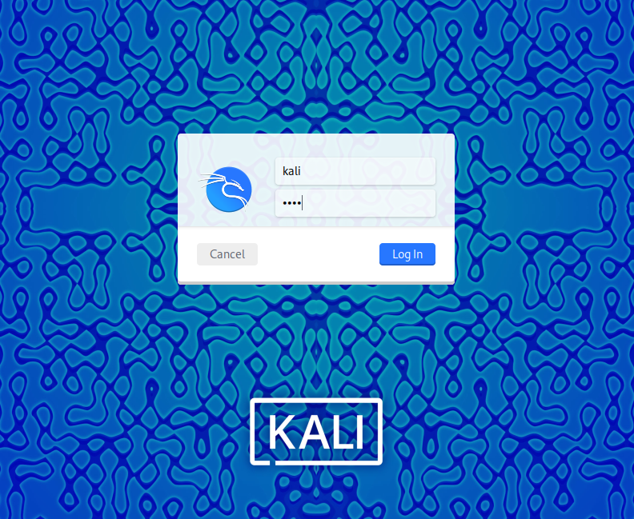
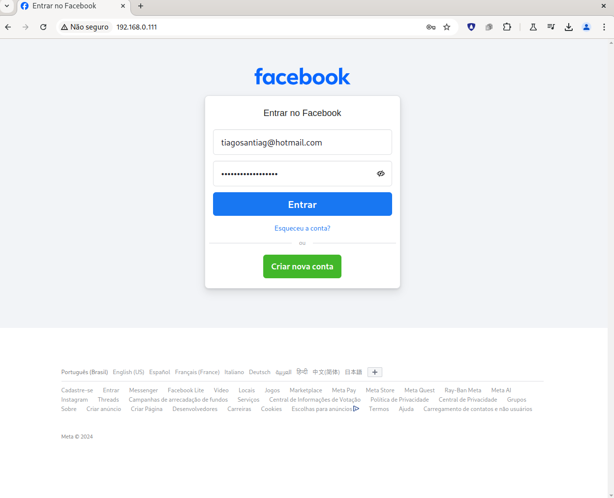

<h1>
<a href="https://www.dio.me/">
     </a>
    <span> Santander Bootcamp Cibersegurança #2</span>
</h1>

# :computer: Criação de um Phishing com o Kali Linux

O objetivo desse desafio é clonar a página do facebook para phishing de credenciais. 

[Github instrutor](https://github.com/cassiano-dio/cibersecurity-desafio-phishing)


# :bulb: Solução do desafio

Primeiramente é necessário baixar a imagem do [Kali Linux](https://www.kali.org/get-kali/#kali-platforms), utilizarei a imagem para [VirtualBox](https://www.virtualbox.org/).

O usuário e senha padrão são: kali



Acessando a setoolkit como root, temos o menu:

```
Select from the menu:

   1) Social-Engineering Attacks
   2) Penetration Testing (Fast-Track)
   3) Third Party Modules
   4) Update the Social-Engineer Toolkit
   5) Update SET configuration
   6) Help, Credits, and About

  99) Exit the Social-Engineer Toolkit
```

É escolhido `Social-Engineering Attacks`, nos próximos menus:
`Web Site Attack Vectors` :arrow_right: `Credential Harvester Attack Method`  :arrow_right: `Site Cloner` 

 

Foi obtido o campo de login, porém a senha retornada está criptografada. Veja o artigo:

[Sobre o Setoolkit e o Facebook - Romullo Silva](https://www.dio.me/articles/sobre-o-setoolkit-e-o-facebook). 

```console
POSSIBLE USERNAME FIELD FOUND: email=tiagosantiag@hotmail.com                
POSSIBLE PASSWORD FIELD FOUND: had_password_prefilled=false                  
POSSIBLE PASSWORD FIELD FOUND: encpass=#PWD_BROWSER:5:1735662738:AV1QAI43ysdfwsFx10SSVxvDgeh6M4TfhhIKhNmgmjZrFN9w/FhJUFne0fCWEVbJvBZeW65B2+xKVAWTwfj6OPkMu3gDj0Eic3ISaa+pv+/sMEvtpSzEH+AI16+TqCelWotWvTuHmfDMSdYJb8ry8lg=              
[*] WHEN YOU'RE FINISHED, HIT CONTROL-C TO GENERATE A REPORT.   
```